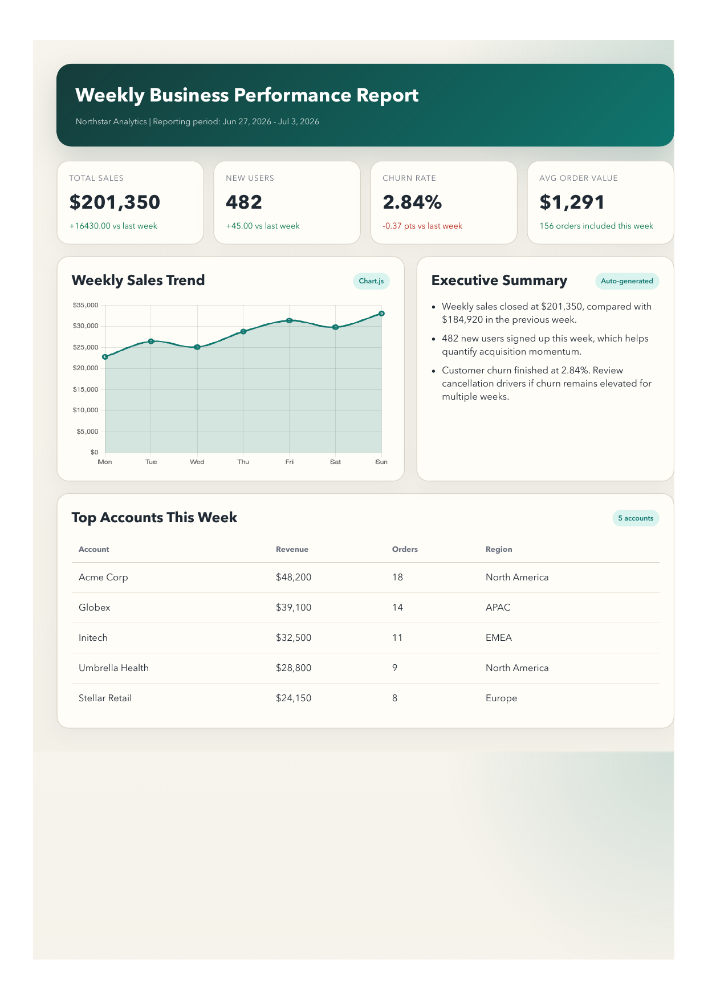

# Automated Executive PDF Reporting Pipeline



An end-to-end reporting automation project designed to showcase the kind of work an `Automation Solution Architect` would deliver: extracting business metrics, transforming data into executive-friendly insights, generating polished PDF reports, and orchestrating repeatable delivery.

This project simulates a weekly reporting workflow for leadership teams or client stakeholders. It is built to be demo-friendly without requiring a real production database, while still preserving a realistic architecture that can be adapted to enterprise environments.

## Portfolio Highlights

- Built an end-to-end automation flow from data ingestion to executive-ready PDF delivery
- Designed for both portfolio demonstration and future production adaptation
- Uses browser-based rendering for polished, branded reporting output
- Separates data, presentation, rendering, and delivery into reusable modules
- Supports scheduled operation patterns suitable for internal reporting or client reporting services

## Why This Project Matters

Manual reporting is a common operational bottleneck:

- Analysts export data from multiple systems
- Teams copy KPIs into slides or spreadsheets
- Reports are reformatted every week
- Distribution depends on human follow-through

This project automates that lifecycle by turning raw metrics into a scheduled reporting product.

## Solution Overview

The pipeline supports two operating modes:

- `mock` mode for portfolio demos and local testing
- `postgres` mode for real database-backed reporting

Core workflow:

1. Query weekly business metrics from PostgreSQL or load mock demo data
2. Transform the results into a report view model
3. Render an HTML dashboard with KPIs, tables, and Chart.js visualizations
4. Convert the rendered page into a production-style PDF with Puppeteer
5. Optionally email the PDF to stakeholders with SendGrid

## Architecture

```text
PostgreSQL / Mock Data
        |
        v
  SQL Queries / Data Loaders
        |
        v
   Report View Model Builder
        |
        v
 Handlebars HTML Template + CSS + Chart.js
        |
        v
 Puppeteer PDF Rendering
        |
        v
 Local Output / Email Delivery
```

## Business Use Cases

This pattern is useful for:

- Weekly executive KPI packs
- Client-facing account performance reports
- Operations scorecards
- Sales summaries
- Renewal, churn, or usage reporting
- Automated compliance or audit reporting

## Technical Stack

- `Node.js`
- `PostgreSQL`
- `Handlebars`
- `Chart.js`
- `Puppeteer`
- `SendGrid`

## Key Design Decisions

- `Mock-first execution`: the project can run immediately without access to production systems
- `Modular architecture`: data access, HTML rendering, PDF generation, and email delivery are separated cleanly
- `HTML-to-PDF approach`: using browser rendering enables branded, pixel-precise output
- `Operational flexibility`: email delivery can be disabled while validating report generation locally
- `Portfolio realism`: SQL files, scheduling guidance, and environment configuration mirror a real automation rollout

## Repository Structure

```text
.
├── assets/
│   └── report.css
├── output/
│   ├── weekly-report.html
│   └── weekly-report.pdf
├── sql/
│   ├── daily_sales_trend.sql
│   ├── top_accounts.sql
│   └── weekly_summary.sql
├── src/
│   ├── config.js
│   ├── data.js
│   ├── db.js
│   ├── generatePdf.js
│   ├── index.js
│   ├── renderHtml.js
│   └── sendEmail.js
└── templates/
    └── weekly-report.hbs
```

## Demo Output

Sample generated artifacts are written to:

- [weekly-report.html](/Users/hanqin/Desktop/Automated-PDF-Report-Generator/output/weekly-report.html)
- [weekly-report.pdf](/Users/hanqin/Desktop/Automated-PDF-Report-Generator/output/weekly-report.pdf)

These files demonstrate the final presentation layer of the automation flow.

## Local Setup

This project has already been prepared to run locally in `mock` mode.

Install dependencies:

```bash
npm install
```

Create your environment file:

```bash
cp .env.example .env
```

Recommended local demo configuration:

```env
DATA_SOURCE=mock
SEND_EMAIL=false
PUPPETEER_EXECUTABLE_PATH=/Applications/Google Chrome.app/Contents/MacOS/Google Chrome
```

## Run the Project

Generate the HTML and PDF report:

```bash
npm run generate
```

Run the main entrypoint:

```bash
npm start
```

If `SEND_EMAIL=false`, the application will generate artifacts but skip outbound email delivery.

## Switching to Real Data

To connect the project to a real PostgreSQL source:

1. Set `DATA_SOURCE=postgres` in `.env`
2. Provide a valid `DATABASE_URL`
3. Update the SQL in:
   - [weekly_summary.sql](/Users/hanqin/Desktop/Automated-PDF-Report-Generator/sql/weekly_summary.sql)
   - [daily_sales_trend.sql](/Users/hanqin/Desktop/Automated-PDF-Report-Generator/sql/daily_sales_trend.sql)
   - [top_accounts.sql](/Users/hanqin/Desktop/Automated-PDF-Report-Generator/sql/top_accounts.sql)
4. Map the queries to your actual schema, such as:
   - `orders`
   - `users`
   - `subscriptions`
   - `accounts`

## Email Delivery

To enable email delivery:

```env
SEND_EMAIL=true
SENDGRID_API_KEY=your_key_here
EMAIL_FROM=reports@example.com
EMAIL_TO=leadership@example.com,ops@example.com
```

The current implementation attaches the generated PDF to a SendGrid email, which is suitable for internal reporting flows and client-ready distribution.

## Scheduling and Operations

This project is intentionally shaped like an operational automation asset rather than a one-off script.

Example cron schedule for Monday morning delivery:

```bash
0 9 * * 1 cd /Users/hanqin/Desktop/Automated-PDF-Report-Generator && /opt/homebrew/bin/node src/index.js >> /tmp/weekly-report.log 2>&1
```

In a production setting, the same workflow could be scheduled through:

- `cron`
- GitHub Actions
- AWS Lambda
- Cloud Run jobs
- Airflow
- enterprise orchestration tools

## What This Demonstrates for an Automation Solution Architect Role

- Ability to design an end-to-end automation workflow instead of a single-script solution
- Understanding of how to bridge data systems, presentation layers, and delivery channels
- Awareness of stakeholder needs: executive readability, reliability, repeatability, and operational controls
- Practical system thinking around configuration, scheduling, fallback modes, and extensibility
- Ability to build demoable solutions that can evolve into production implementations

## Suggested Resume Positioning

You can describe this project along lines like:

- Designed and implemented an automated reporting pipeline that converts business metrics into branded executive PDF reports using Node.js, Handlebars, Puppeteer, and SendGrid
- Built a modular workflow supporting both mock and PostgreSQL-backed execution, enabling portfolio demos and future production integration
- Automated report rendering and scheduled delivery patterns to reduce manual KPI compilation and improve reporting consistency for leadership stakeholders

## Future Extensions

- Add multi-tenant/client-specific report generation
- Introduce richer segmentation and drill-down pages
- Add LLM-generated executive commentary based on metric changes
- Store delivery history and audit logs
- Add CI validation for template rendering
- Deploy as a serverless or containerized scheduled service
